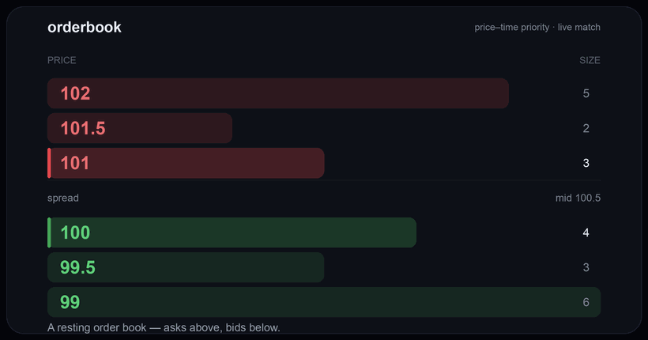

# orderbook

<p align="center">
  <a href="https://intrepidkarthi.github.io/orderbook/"></a>
</p>

<p align="center"><b><a href="https://intrepidkarthi.github.io/orderbook/">▶ Live demo</a></b> — the real engine, compiled to WebAssembly, running in your browser.</p>

A production-grade central limit order book (CLOB) and matching engine in Go:
integer-exact pricing, a zero-allocation hot path, a lock-free single-writer
core, and deterministic, replayable execution.

[](https://pkg.go.dev/github.com/intrepidkarthi/orderbook)
[](https://github.com/intrepidkarthi/orderbook/actions/workflows/ci.yml)
[](https://goreportcard.com/report/github.com/intrepidkarthi/orderbook)

[](LICENSE)
[](https://intrepidkarthi.github.io/orderbook/)

`orderbook` is an embeddable Go library — `go get` it into an exchange, a
simulator, or a trading tool. The matching core owns the order book, the matching
algorithm, order lifecycle, deterministic sequencing, and market-data snapshots,
plus a set of opt-in **pre-trade risk & anti-manipulation controls**; credit,
identity, fees, and wire protocols stay in the layers around it, the same
boundary production venues draw. Companion packages cover the rest of that
boundary — durable WAL persistence (`pkg/wal`), market-abuse surveillance
(`pkg/surveillance`), an enforcing edge gateway (`pkg/gateway`), and a
uniform-price call auction (`pkg/auction`). Every defensive control is grounded
in a real enforcement case or incident, catalogued in
[docs/THREAT-MODEL.md](docs/THREAT-MODEL.md). The repository also ships a
reproducible market-microstructure research harness and an interactive
WebAssembly demo that runs the real engine in the browser.

---

## Highlights

- **Integer-exact pricing.** The engine works in `int64` ticks and lots; a
  per-symbol `Instrument` converts decimals only at the API boundary. No
  floating-point on the money path.
- **Low latency, zero allocation.** O(1) cancel, pooled book nodes and price
  levels, and a caller-buffer match path that allocates **0 B/op**. A realistic
  cancel-heavy flow runs at **p50 83 ns · p99 167 ns · p999 292 ns** per
  operation.
- **Single-writer core.** One matching goroutine owns the book with no lock on
  the hot path (the LMAX model). A `Runner` fronts it with an MPSC command queue
  so many producers can submit concurrently.
- **Deterministic and recoverable.** The same ordered command stream produces
  byte-identical trades and book state — enabling command-log replay, durable
  WAL crash recovery (`pkg/wal`: write-ahead log + snapshots), and reproducible
  backtests.
- **Full order surface.** Limit, market, stop / stop-limit, iceberg (hidden),
  post-only, pegged, OCO / bracket, and trailing-stop orders; GTC / IOC / FOK
  time-in-force; self-trade prevention; a price-band circuit breaker; FIFO or
  pro-rata allocation.
- **Market integrity & safety.** Opt-in pre-trade risk controls — fat-finger and
  dust caps, per-account order limits, minimum resting time, client-order-id
  idempotency, mark-price step **and** depth bounds, a self-output guardrail, and
  timed band-breach pauses — plus a market-abuse surveillance suite (spoofing,
  order-to-trade ratio, marking-the-close, ramping, pinging, cross-book), an
  enforcing gateway (rate limit + speed bump), and a uniform-price call auction.
  Each maps to a real case in [docs/THREAT-MODEL.md](docs/THREAT-MODEL.md).
- **Market data.** L1 / L2 / L3 (market-by-order) snapshots with sequence
  numbers.
- **Tested and benchmarked.** Race, fuzz, soak, and replay-recovery suites;
  microbenchmarks run in CI on every push.

---

## Installation

```sh
go get github.com/intrepidkarthi/orderbook/pkg/matching
```

Requires Go 1.23 or later.

---

## Quickstart

The engine works in integer ticks and lots. Pass them directly, or use an
`Instrument` to convert from decimals at the boundary.

```go
eng := matching.NewEngine(matching.DefaultConfig("BTC-USD"))

// A resting sell, then a crossing buy that trades against it at the maker price.
sell, _ := types.NewOrder("mm", "BTC-USD", types.SideSell, types.OrderTypeLimit, 100, 5, types.TIFGoodTillCancel)
eng.Process(sell)

buy, _ := types.NewOrder("taker", "BTC-USD", types.SideBuy, types.OrderTypeLimit, 101, 3, types.TIFGoodTillCancel)
res := eng.Process(buy) // res.Trades, res.Status, res.RejectionReason

bid, qty, ok := eng.BestBid()
```

Decimals at the boundary, concurrent submission, and the zero-allocation path:

```go
// Decimals in, int64 ticks/lots out.
inst := types.NewInstrument("BTC-USD", decimal.RequireFromString("0.01"), decimal.RequireFromString("0.001"))
order, _ := inst.NewOrder("alice", types.SideBuy, types.OrderTypeLimit,
    decimal.RequireFromString("30000.50"), decimal.RequireFromString("0.25"), types.TIFGoodTillCancel)

// Many producers, one matching goroutine.
r := matching.NewRunner(matching.RunnerConfig{Engine: matching.DefaultConfig("BTC-USD")})
defer r.Close()
r.SubmitAsync(order) // enqueue without blocking; result arrives on the returned channel

// Zero-allocation hot path: reuse the trade buffer across calls.
buf := make([]types.Trade, 0, 8)
buf, status, _ := eng.Match(order, buf[:0])
```

Runnable, testable examples render on
[pkg.go.dev](https://pkg.go.dev/github.com/intrepidkarthi/orderbook/pkg/matching#pkg-examples).

---

## Concurrency model

| | `matching.Engine` | `matching.Runner` |
|---|---|---|
| Contract | single writer — drive from **one** goroutine | safe for **concurrent** producers |
| Mechanism | direct calls, no lock on the hot path | MPSC command queue → one matching goroutine |
| Submit | `Process` (result) · `Match` (zero-alloc, into a buffer) | `Process` (enqueue + wait) · `SubmitAsync` (non-blocking) |
| Reads | `BestBid` / `Snapshot` / … (book has its own RW-lock) | same, delegated to the engine |
| Use when | you own the sequencing loop; benchmarks | any multi-goroutine service |

The bare `Engine` has no internal mutex by design; calling its mutating methods
from multiple goroutines is a data race. Use a `Runner`, or serialize to one
goroutine. See [docs/INTEGRATION.md](docs/INTEGRATION.md).

---

## Performance

Core-library microbenchmarks (Apple M-series, Go 1.23, single-threaded):

| Benchmark | ns/op | allocs/op | ~ops/sec |
|---|---:|---:|---:|
| Top-of-book read (`BestBid`) | 6.3 | 0 | ~160 M |
| Cancel (drain) | 253 | 0 | ~4 M |
| Cancel / replace (book) | 180 | 0 | ~5.5 M |
| New price level (churn) | 292 | 0 | ~3.4 M |
| Match round-trip — `Match` (maker + taker + trade) | 352 | **0** | ~2.8 M |
| Match round-trip — `Process` (convenience wrapper) | 491 | 4 | ~2 M |

Tail latency on a realistic ~90%-cancel / 10%-new flow (`Match` / `Cancel`):
**p50 83 ns · p99 167 ns · p999 292 ns**, 0 allocs/op — the p999 stays within
~3.5× of the median. Absolute figures include `time.Now` overhead; the
median-to-tail shape is the signal.

Reproduce with `make bench`. CI runs the benchmarks on every push. Methodology
and full results: [docs/BENCHMARKS.md](docs/BENCHMARKS.md).

---

## Architecture

The core is a strictly downward-layered set of packages. Research, simulation,
and the web demo depend on the core; the core depends on nothing above it.

```
web/ (React + TS)  ──▶  cmd/obwasm (Go → WASM)  ─┐
                                                 │
   backtest ▸ strategy ▸ sim ▸ signals ▸ marketdata
                                                 │
        ═══════════════ CORE LIBRARY ════════════▼═══════
           surveillance ▸ matching ▸ orderbook ▸ types
```

| Package | Responsibility |
|---|---|
| `pkg/types` | `Order`, `Trade`, `Instrument` (decimal ⇄ tick boundary), order-type wrappers |
| `pkg/orderbook` | the CLOB data structure and L1/L2/L3 snapshots |
| `pkg/matching` | the single-writer `Engine` and the concurrent `Runner` |
| `pkg/marketdata` | record, replay, and digest — deterministic recovery primitives |

---

## Documentation

| Document | Contents |
|---|---|
| [API reference](https://pkg.go.dev/github.com/intrepidkarthi/orderbook) | Generated Go documentation for every package, with runnable examples, on pkg.go.dev. |
| [INTEGRATION.md](docs/INTEGRATION.md) | Embedding the engine: reference architecture, single-writer vs concurrent, WAL and recovery, market-data fan-out, observability, multi-symbol scaling, and a production checklist. |
| [CONFIG.md](docs/CONFIG.md) | Every configuration knob — `Instrument`, engine policy, time-in-force, order types — with defaults, validation, and the core-vs-layer boundary. |
| [THREAT-MODEL.md](docs/THREAT-MODEL.md) | Attacks hackers and market manipulators run against order books — spoofing, wash trading, marking the close, quote stuffing, oracle manipulation, and more — each mapped to a real enforcement case and to what the engine does (and doesn't) defend. |
| [EXCHANGE-ARCHITECTURE.md](docs/EXCHANGE-ARCHITECTURE.md) | How real venues (MetaTrader, Binance, Coinbase, Nasdaq/LMAX/CME/IEX, dYdX/Hyperliquid) implement matching, and the incidents that shaped this design. |
| [SPEC.md](docs/SPEC.md) | Architecture, the order model, core design decisions, and performance targets. |
| [BENCHMARKS.md](docs/BENCHMARKS.md) | Performance results, methodology, and how to reproduce. |
| [LEARN.md](docs/LEARN.md) | Order books and market making from first principles. |
| [research-roadmap.md](docs/research-roadmap.md) | The microstructure research agenda: OFI, Kyle's λ, Avellaneda–Stoikov, delta/CVD. |
| [CHANGELOG.md](CHANGELOG.md) | Release history (v0.1.0 → the unreleased market-integrity set) with breaking-change notes. |

---

## Beyond the engine

The same core powers two additional layers, kept strictly above the library:

- **Research harness** — order-flow-imbalance and book-imbalance signals, a
  deterministic exchange simulator, an Avellaneda–Stoikov market-making backtest,
  and a reproducible study of OFI's contemporaneous-versus-predictive power.
  Market-abuse surveillance (spoofing/layering and rate limits) and call-auction
  uncrossing are included.
- **Interactive demo** — the engine compiled to WebAssembly, running live in the
  [browser](https://intrepidkarthi.github.io/orderbook/) to visualize matching
  and market making.

```sh
go run ./examples/basic         # place two orders and watch them match
go run ./examples/eventfeed     # consume the event stream as an exec-report + position feed
go run ./examples/gateway       # edge controls: enforcing rate gate, speed bump, audit trail
go run ./examples/marketmaker   # backtest an Avellaneda–Stoikov maker
go run ./cmd/obdemo             # end-to-end matching demonstration
go run ./cmd/l2capture          # live order-flow imbalance on Coinbase data
```

---

## Contributing

Contributions are welcome — bug fixes, order types, signals, strategies,
surveillance detectors, protocol codecs, or research write-ups. Start with
[CONTRIBUTING.md](CONTRIBUTING.md) (`make check` before a PR), and open an issue
or discussion if you want to talk through an idea first.

**Good places to start** (open an issue to claim one):

- **Render the markdown docs to HTML** in the Pages build so the hosted docs stay
  in sync with source automatically.
- **Protocol codecs** — a FIX / OUCH / SBE adapter package translating the wire ↔
  `types.Order` and the `EventSink` stream ↔ execution reports.
- **New `EventSink` kinds** — emit the reserved `Triggered` / `BookDelta` events.
- **A metrics exporter** — a Prometheus/`expvar` adapter off the event stream (the
  `Metrics` seam), with an example.
- **More surveillance** — a quote-fading detector, or a wash-trade detector keyed
  on beneficial-ownership groups (the cross-account case the core can't see).
- **More signals** — micro-price, VPIN, or a queue-position model in `pkg/signals`.
- **GTD / DAY time-in-force** with expiry, and richer `Instrument` validation.

If the library is useful to you, a ⭐ helps other developers find it.

## Status

Actively developed. Releases follow semantic versioning; the public API uses
integer ticks/lots and a single-writer engine as of `v0.3.0`, with a
threat-model-driven market-integrity layer as of `v0.6.0`. Breaking changes are
gated behind minor-version bumps until a `v1.0.0` API freeze. See the
[CHANGELOG](CHANGELOG.md).

## Provenance

The design is informed by the author's prior production matching engine —
price–time priority, the map-plus-ladder book structure, and the matching
algorithm. This repository is a clean, independent re-implementation for research
and education, not a copy of that stack.

## License

[MIT](LICENSE) © Karthikeyan NG

<sub>Topics: order-book · matching-engine · limit-order-book · clob · market-making · avellaneda-stoikov · order-flow-imbalance · market-microstructure · backtesting · algorithmic-trading · quantitative-finance · webassembly · golang · exchange · price-time-priority</sub>
