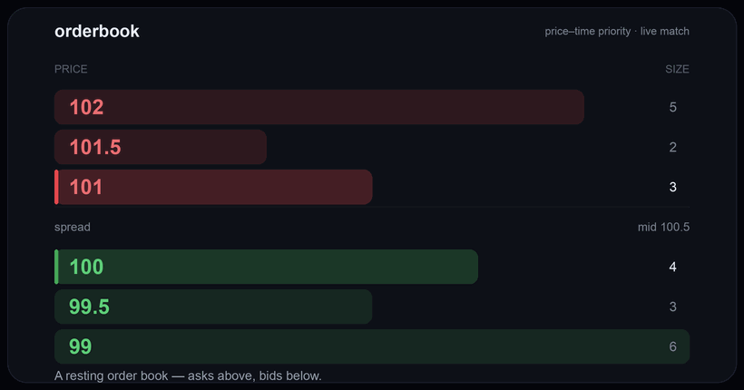

# orderbook

<p align="center">
  <a href="https://intrepidkarthi.github.io/orderbook/"></a>
</p>

<p align="center"><b><a href="https://intrepidkarthi.github.io/orderbook/">▶ Live demo</a></b> — the real engine, compiled to WebAssembly, running in your browser · <b><a href="https://intrepidkarthi.github.io/orderbook/console.html">▶ Live console</a></b> — a running market with signals and surveillance, every panel titled by the call that produces it.</p>

An embeddable matching core in Go, with a demonstrated network seam:
integer-exact pricing, a zero-allocation match path, a lock-free single-writer
core, deterministic and machine-checked crash recovery, and a reference
order-entry gateway that speaks a frozen binary protocol over TCP. And one
document most libraries don't have: an honest account of what production takes
and how far this goes ([docs/PRODUCTION-READINESS.md](docs/PRODUCTION-READINESS.md)).

[](https://pkg.go.dev/github.com/intrepidkarthi/orderbook)
[](https://github.com/intrepidkarthi/orderbook/actions/workflows/ci.yml)
[](https://goreportcard.com/report/github.com/intrepidkarthi/orderbook)

[](LICENSE)
[](https://intrepidkarthi.github.io/orderbook/)

`orderbook` is an embeddable Go library — `go get` it into an exchange, a
simulator, or a trading tool. The matching core owns the order book, the matching
algorithm, order lifecycle, deterministic sequencing, and market-data snapshots,
plus a set of opt-in **pre-trade risk & anti-manipulation controls**; credit,
identity, fees, and wire protocols stay in the layers around it, the same
boundary production venues draw. Companion packages cover the rest of that
boundary — durable WAL persistence (`pkg/wal`), market-abuse surveillance
(`pkg/surveillance`), in-process pre-trade admission control (`pkg/gateway`),
and a uniform-price call auction (`pkg/auction`). Every defensive control is
grounded in a real enforcement case or incident, catalogued in
[docs/THREAT-MODEL.md](docs/THREAT-MODEL.md). The repository also ships a
reproducible market-microstructure research harness and an interactive
WebAssembly demo that runs the real engine in the browser.

**Scope.** *Embeddable* concedes the venue is not here — and no adjective in
this README claims what only a deployment can prove. Production readiness is a
property of a deployment, not of code:
[docs/PRODUCTION-READINESS.md](docs/PRODUCTION-READINESS.md) is the honest
account of what is solid, what is partial, and what is yours. Nobody runs this
in production today, and this paragraph will say so until someone does.

What ships: the matching core, durable recovery, an event stream proven to
reconstruct the book, an operator kill switch, a frozen binary protocol
([docs/PROTOCOL.md](docs/PROTOCOL.md)), and `cmd/obgw` — a reference TCP gateway
serving **both edges**: order entry with authentication, per-account outbound streams
and gap-free resume across a disconnect, and a public market-data feed with
snapshot-plus-delta recovery. Bounded backpressure at every stage. Around it:
`EngineSnapshot.Digest` (the book fingerprint replication and recovery agree on),
`examples/replication` (the drilled primary-backup reference), `cmd/obdash` (an
operator dashboard that is an ordinary subscriber of the venue's own feed), and a
[live console](https://intrepidkarthi.github.io/orderbook/console.html) running
the engine, signals and surveillance in the browser.

What does not, and is yours: **continuous operation** (the command log never
shrinks and a restart reads all of it, so a venue left running becomes slower and
hungrier to restart every day it stays up — the first thing to fix before running
this for a week), **credential lifecycle** (the reference speaks TLS and
holds secret digests, never plaintext — but rotation, revocation and expiry are
yours, and it says so), **multi-symbol routing** (order ids and
sequences are per-engine, so several symbols means several engines and a router
above them), **clearing and settlement**, and **any HA topology** — the library
ships the seams for primary-backup (deterministic apply, an ordered command log,
replay mode, snapshot bootstrap), proves them with a reference example and CI
drills ([docs/REPLICATION.md](docs/REPLICATION.md)), and deliberately not the
consensus, because bundling one forces a wrong answer on everybody. See
[docs/EXCHANGE-ARCHITECTURE.md](docs/EXCHANGE-ARCHITECTURE.md) for why, including
the venues that lost quorum getting it wrong.

The engine has never run a live market. **Production-readiness is a property of
your deployment, not of this library** — what is offered here is that the pieces
you build on are correct, tested, and honest about their edges.
[docs/PRODUCTION-READINESS.md](docs/PRODUCTION-READINESS.md) is the checklist: what
ships, what is deliberately absent, what you would have to build — and which gaps
no library work can close, because they are properties of your deployment.

---

## Highlights

- **Integer-exact pricing.** The engine works in `int64` ticks and lots; a
  per-symbol `Instrument` converts decimals only at the API boundary. No
  floating-point on the money path.
- **Low latency, zero allocation.** O(1) cancel, pooled book nodes and price
  levels, and a caller-buffer match path that allocates **0 B/op**. A realistic
  cancel-heavy flow runs at **p50 83 ns · p99 167 ns · p999 250 ns** per
  operation.
- **Single-writer core.** One matching goroutine owns the book with no lock on
  the hot path (the LMAX model). A `Runner` fronts it with an MPSC command queue
  so many producers can submit concurrently.
- **Deterministic and recoverable.** The same ordered command stream produces
  byte-identical trades and book state — enabling command-log replay, durable
  WAL crash recovery (`pkg/wal`: write-ahead log + snapshots), and reproducible
  backtests. `Runner.Checkpoint` and `wal.Recover` join the snapshot to its log
  position, and the property is gated in CI against a 2,000-command tape:
  checkpoint anywhere, recover, and the book, all three sequence counters, the
  duplicate guard and the conditional-order state match the uninterrupted run. What
  a snapshot bounds is the *replay*, not the read: recovery still parses the whole
  log, and nothing rotates it, so restart cost grows with every day a venue stays up
  — measured, and unfixed, in
  [docs/PRODUCTION-READINESS.md](docs/PRODUCTION-READINESS.md).
- **An event stream that reconstructs the book.** `Accepted`/`Trade`/`Canceled`/
  `Replaced` replay into an L3 book identical to the engine's, asserted on every
  commit across 23 scenarios covering every order class — including iceberg
  refill, all five self-trade-prevention modes, FOK reversal and cascade-fired
  stops.
- **Full order surface.** Limit, market, stop / stop-limit, iceberg (hidden),
  post-only, pegged, OCO / bracket, and trailing-stop orders; GTC / IOC / FOK / DAY /
  GTD time-in-force, with the venue holding the deadline rather than the client
  remembering to cancel; self-trade prevention; a price-band circuit breaker; FIFO or
  pro-rata allocation.
- **A trading session.** Pre-open accepts orders without matching them, so the book
  accumulates and may legitimately cross; opening resolves it at a single clearing
  price by auction, in price-time priority, so a venue never opens onto a crossed book.
  The engine holds no calendar — it knows what each phase permits, not when phases
  change, because that is the venue's business.
- **Market integrity & safety.** Opt-in pre-trade risk controls — fat-finger and
  dust caps, per-account order limits, minimum resting time, client-order-id
  idempotency, mark-price step **and** depth bounds, a self-output guardrail, and
  timed band-breach pauses — plus a market-abuse surveillance suite (spoofing,
  order-to-trade ratio, marking-the-close, ramping, pinging, cross-book), an
  enforcing per-account rate gate, an operator kill switch, and a
  uniform-price call auction. Each maps to a real case in
  [docs/THREAT-MODEL.md](docs/THREAT-MODEL.md). The taker speed bump is an
  observation hook, not enforcement — it reports, it does not delay.
- **A network edge that works.** `cmd/obgw` is a reference TCP order-entry
  gateway: authentication defaulting to deny, a frozen binary protocol
  ([docs/PROTOCOL.md](docs/PROTOCOL.md)), per-account outbound streams that
  outlive a connection, and gap-free resume — reconnect with your cursor and
  receive the fills that landed while you were disconnected. A client can never
  name another account's order, because the wire has no field for it.

  The full client lifecycle is on the wire: six order types (limit, market, stop /
  stop-limit, OCO, iceberg, pegged, trailing), **reduce in place keeping queue
  position**, **atomic cancel/replace**, **mass cancel**, cancel-on-disconnect, and
  **query your open orders** when resume is not available. Orders that outlive a
  restart stay nameable and keep reporting their fills.
- **An admin edge, and a soak harness that used it.** `cmd/obgw -admin` serves
  Prometheus metrics, `/healthz` and `/readyz` on a third port — counters off the
  engine's own event stream, so they count what the book saw rather than what the
  gateway believed it sent, and nothing a scrape touches goes through the command
  queue. `cmd/obsoak` drives the venue at a sustained rate and reports what grows.
  The longest run is four hours over three books — 14.4M messages, goroutines and
  descriptors flat across 240 samples, no orphans ([docs/SOAK.md](docs/SOAK.md) §1e).
  The first hour of ever running it found a defect that the whole test suite, two
  fuzzers and the race detector had not: under load the venue refused cancels for orders live in its
  own book, and filled to its order ceiling while reporting itself healthy. Fixed,
  regression-tested, and written up in [docs/SOAK.md](docs/SOAK.md).
- **A market-data edge.** `cmd/obgw -mdaddr` publishes the venue's public feed on its
  own listener: a snapshot naming the sequence it is consistent with, then incremental
  level changes, trade prints and venue-state changes in one dense, gap-free stream.
  A subscriber holding a cursor gets a gap-fill instead; one too far behind, or from
  another venue incarnation, is refused explicitly rather than quietly resynchronised.
  The guarantee — snapshot plus everything after its sequence equals the engine's book
  — is asserted both in-process and end to end over a socket.
- **Market data.** L1 / L2 / L3 (market-by-order) snapshots with sequence numbers,
  plus `marketdata.L2Feed` — incremental aggregated depth derived from the event
  stream, coalesced per command, with absolute quantities so a subscriber that misses
  an update recovers on the next one. Its test asserts the derived levels equal the
  engine's own snapshot after every command, which is how a long-standing depth bug
  was found.
- **Tested and benchmarked.** Race, fuzz, soak, and replay-recovery suites;
  microbenchmarks run in CI on every push.

---

## Installation

```sh
go get github.com/intrepidkarthi/orderbook/pkg/matching
```

Requires Go 1.23 or later.

---

## Quickstart

The engine works in integer ticks and lots. Pass them directly, or use an
`Instrument` to convert from decimals at the boundary.

```go
eng := matching.NewEngine(matching.DefaultConfig("BTC-USD"))

// A resting sell, then a crossing buy that trades against it at the maker price.
sell, _ := types.NewOrder("mm", "BTC-USD", types.SideSell, types.OrderTypeLimit, 100, 5, types.TIFGoodTillCancel)
eng.Process(sell)

buy, _ := types.NewOrder("taker", "BTC-USD", types.SideBuy, types.OrderTypeLimit, 101, 3, types.TIFGoodTillCancel)
res := eng.Process(buy) // res.Trades, res.Status, res.RejectionReason

bid, qty, ok := eng.BestBid()
```

Decimals at the boundary, concurrent submission, and the zero-allocation path:

```go
// Decimals in, int64 ticks/lots out.
inst := types.NewInstrument("BTC-USD", decimal.RequireFromString("0.01"), decimal.RequireFromString("0.001"))
order, _ := inst.NewOrder("alice", types.SideBuy, types.OrderTypeLimit,
    decimal.RequireFromString("30000.50"), decimal.RequireFromString("0.25"), types.TIFGoodTillCancel)

// Many producers, one matching goroutine.
r := matching.NewRunner(matching.RunnerConfig{Engine: matching.DefaultConfig("BTC-USD")})
defer r.Close()
r.SubmitAsync(order) // enqueue without blocking; result arrives on the returned channel

// Zero-allocation hot path: reuse the trade buffer across calls.
buf := make([]types.Trade, 0, 8)
buf, status, _ := eng.Match(order, buf[:0])
```

Or run the reference gateway and talk to it over a socket:

```sh
go run ./cmd/obgw -addr 127.0.0.1:9000 -symbol BTC-USD -accounts alice:s3cret
```

`cmd/obgw`'s tests are a working client — login, enter, cancel, reduce, query,
resume — and are the most useful reference for writing another one. The protocol
helpers live in `server_test.go`.

Runnable, testable examples render on
[pkg.go.dev](https://pkg.go.dev/github.com/intrepidkarthi/orderbook/pkg/matching#pkg-examples).

---

## Concurrency model

| | `matching.Engine` | `matching.Runner` |
|---|---|---|
| Contract | single writer — drive from **one** goroutine | safe for **concurrent** producers |
| Mechanism | direct calls, no lock on the hot path | MPSC command queue → one matching goroutine |
| Submit | `Process` (result) · `Match` (zero-alloc, into a buffer) | `Process` (enqueue + wait) · `SubmitAsync` (non-blocking) |
| Reads | `BestBid` / `Snapshot` / … (book has its own RW-lock) | same, delegated to the engine |
| Use when | you own the sequencing loop; benchmarks | any multi-goroutine service |

The bare `Engine` has no internal mutex by design; calling its mutating methods
from multiple goroutines is a data race. Use a `Runner`, or serialize to one
goroutine. See [docs/INTEGRATION.md](docs/INTEGRATION.md).

---

## Performance

Core-library microbenchmarks (Apple M4, `go1.23.5 darwin/arm64`, single-threaded):

| Benchmark | ns/op | allocs/op | ~ops/sec |
|---|---:|---:|---:|
| Top-of-book read (`BestBid`) | 5.8 | 0 | ~170 M |
| Cancel (drain, 200 K-order book) | 65 | 0.0002 | ~15 M |
| Cancel (drain, 10 M-order book) | 273 | 0.0002 | ~3.7 M |
| Cancel / replace (10 K-order book) | 172 | 0.009 | ~5.8 M |
| New price level (churn) | 292 | 0 | ~3.4 M |
| Maker + taker match — `Match` (into caller buffer) | 329 | **0** | ~3.0 M |
| Maker + taker match — `Process` (convenience wrapper) | 419 | 4 | ~2.4 M |

Median of 5 runs on an idle machine; ±10% run to run. The fractional allocation
counts are deliberate: Go prints `allocs/op` as integer division, so "0" can mean
anything under 1.0. Measured against `runtime.MemStats`, cancel really does allocate
~0.0002 objects per operation — and `Add` into a growing book really does allocate
1.05, which is what "pooled" means rather than "allocation-free".

**Book size is part of the result**, so it is stated. Cancel is given at two depths
because the benchmark's iteration count doubles as the book size, and the 4× spread
between them is cache behaviour, not code. Any book-level benchmark quoted without
its depth — including, until now, this one — is not comparable to anything.

**What these numbers measure.** In-process calls into the matching core, and
nothing else. `*types.Order` values are constructed before `b.ResetTimer()` and
passed directly to the engine, so the figures exclude order allocation, decoding,
validation at the API boundary, network I/O, and the session and order-entry
protocol layers. Those layers exist here (`internal/wire`, `pkg/orderentry`,
`cmd/obgw`) and none of them is measured on this page. They are a measure of the
matching algorithm and its data structures, not of end-to-end order latency in a
venue. Read them as a floor, and treat any real system built on this as strictly
slower.

Tail latency on a realistic ~90%-cancel / 10%-new flow (`Match` / `Cancel`):
**p50 83 ns · p99 167 ns · p999 250 ns**, 0 allocs/op — the p999 stays within ~3×
of the median. Absolute figures include `time.Now` overhead; the median-to-tail
shape is the signal.

**These are the bare `Engine`.** Most embedders use the `Runner` (the
concurrency-safe front), usually with a write-ahead log and an event sink. That
path allocates 3 allocs/op rather than 0, and adding group-committed durability
costs ~30× — dominated by `fsync`, and syncing on every command instead costs a
further ~210×. The zero-allocation claim above is about `Match` into a caller
buffer, not about the concurrent API.
See [docs/BENCHMARKS.md](docs/BENCHMARKS.md#the-durable-path) for the comparison
and for why the durable figures are given as ratios rather than nanoseconds.

Reproduce with `make bench`. CI runs the benchmarks on every push. Methodology
and full results: [docs/BENCHMARKS.md](docs/BENCHMARKS.md).

---

## Architecture

The core is a strictly downward-layered set of packages. Research, simulation,
and the web demo depend on the core; the core depends on nothing above it.

```
web/ (React + TS)  ──▶  cmd/obwasm (Go → WASM)  ─┐
                                                 │
   backtest ▸ strategy ▸ sim ▸ signals ▸ marketdata
                                                 │
        ═══════════════ CORE LIBRARY ════════════▼═══════
           surveillance ▸ matching ▸ orderbook ▸ types
```

| Package | Responsibility |
|---|---|
| `pkg/types` | `Order`, `Trade`, `Instrument` (decimal ⇄ tick boundary), order-type wrappers |
| `pkg/orderbook` | the CLOB data structure and L1/L2/L3 snapshots |
| `pkg/matching` | the single-writer `Engine` and the concurrent `Runner` |
| `pkg/marketdata` | record, replay, and digest — deterministic recovery primitives |
| `pkg/observability` | Prometheus counters, gauges and histograms off the event stream |
| `pkg/wal` | checksummed write-ahead log, snapshots, recovery, and the replication tail |
| `pkg/orderentry` | authentication, per-account streams with resume, and the naming index |
| `pkg/gateway` | enforcing pre-trade admission: rate gate, speed-bump hook, audit |
| `pkg/surveillance` | market-abuse detectors: spoofing, OTR, pinging, ramping, cross-book |
| `pkg/auction` | uniform-price call auction with randomized close |

---

## Documentation

| Document | Contents |
|---|---|
| [API reference](https://pkg.go.dev/github.com/intrepidkarthi/orderbook) | Generated Go documentation for every package, with runnable examples, on pkg.go.dev. |
| [INTEGRATION.md](docs/INTEGRATION.md) | Embedding the engine: reference architecture, single-writer vs concurrent, WAL and recovery, market-data fan-out, observability, multi-symbol scaling, and a production checklist. |
| [CONFIG.md](docs/CONFIG.md) | Every configuration knob — `Instrument`, engine policy, time-in-force, order types — with defaults, validation, and the core-vs-layer boundary. |
| [THREAT-MODEL.md](docs/THREAT-MODEL.md) | Attacks hackers and market manipulators run against order books — spoofing, wash trading, marking the close, quote stuffing, oracle manipulation, and more — each mapped to a real enforcement case and to what the engine does (and doesn't) defend. |
| [EXCHANGE-ARCHITECTURE.md](docs/EXCHANGE-ARCHITECTURE.md) | How real venues (MetaTrader, Binance, Coinbase, Nasdaq/LMAX/CME/IEX, dYdX/Hyperliquid) implement matching, and the incidents that shaped this design. |
| [SPEC.md](docs/SPEC.md) | Architecture, the order model, core design decisions, and performance targets. |
| [BENCHMARKS.md](docs/BENCHMARKS.md) | Performance results, methodology, and how to reproduce. |
| [LEARN.md](docs/LEARN.md) | Order books and market making from first principles. |
| [research-roadmap.md](docs/research-roadmap.md) | The microstructure research agenda: OFI, Kyle's λ, Avellaneda–Stoikov, delta/CVD — and [what data it runs on](docs/research-roadmap.md#0-data-and-scope). |
| [research/ofi.md](docs/research/ofi.md) | Does order-flow imbalance predict the next move? Contemporaneous R² ≈ 0.24, predictive R² ≈ 0.0004 — a ~577× gap, and the little that remains points the other way. |
| [research/kyle-lambda.md](docs/research/kyle-lambda.md) | Price impact measured end to end: the λ a real book produces, why it scales as 1/depth, and what a block order costs against working the same quantity. |
| [research/order-flow.md](docs/research/order-flow.md) | Delta, CVD, and absorption against ground truth: a 94.5%-accurate aggressor rule builds a CVD wrong by 169%, and CVD divergence loses to a price-only control. |
| [RUNBOOKS.md](docs/RUNBOOKS.md) | Procedures for the failures this venue can have — torn log, corrupt snapshot, stuck matcher, dropped publisher batches, evicted subscriber — each written from the code that produces it, with the alert thresholds and what makes each one worse. Includes what has no runbook. |
| [SOAK.md](docs/SOAK.md) | Sustained load: what `cmd/obsoak` measures, the methodology that took three wrong versions to get right, and the correctness defect the first hour of it found. |
| [PRODUCTION-READINESS.md](docs/PRODUCTION-READINESS.md) | What a venue actually needs, with an honest status for each item — what ships, what is deliberately absent, and what you would have to build. Production readiness is a property of a deployment, not of a library, and this says so. |
| [PROTOCOL.md](docs/PROTOCOL.md) | The binary order-entry protocol `cmd/obgw` speaks: framing, session and resume, every message, the reason-code vocabulary, and what is deliberately absent from the wire. |
| [REPLICATION.md](docs/REPLICATION.md) | The primary-backup reference: what "committed" means, the incarnation fence, drills D1–D7 — and §8, what building it actually found versus what the spec predicted. |
| [TRADE-BUST.md](docs/TRADE-BUST.md) | Annulling a published print on an append-only stream: the four things a bust deliberately does *not* rewind, and §7 on the durability gap writing the spec uncovered. |
| [CONSOLE-SPEC.md](docs/CONSOLE-SPEC.md) | The live console and the operator dashboard: why a browser WASM market instead of a feed-connected desktop app, and every panel mapped to the call that produces it. |
| [COMPATIBILITY.md](docs/COMPATIBILITY.md) | What will not move under you: which packages are frozen, which changes are breaking even though they look additive, and the test that makes the promise checkable rather than stated. |
| [TESTING.md](docs/TESTING.md) | The one rule that keeps the rest honest: a test does not count until it has been run against code broken the way it claims to detect. Five case studies from this repository of tests that were green for the wrong reason — or red for none. |
| [CHANGELOG.md](CHANGELOG.md) | Release history with breaking-change notes. |

---

## Beyond the engine

The same core powers two additional layers, kept strictly above the library:

- **Research harness** — order-flow-imbalance, price-impact, and delta/CVD
  signals, a deterministic exchange simulator, an Avellaneda–Stoikov
  market-making backtest, and three reproducible studies in
  [docs/research/](docs/research) that test the popular claims against ground
  truth — and mostly refute them.
  Market-abuse surveillance (spoofing/layering and rate limits) and call-auction
  uncrossing are included. The engine is its own data source — per-order (L3 /
  market-by-order) event streams plus simulator ground truth; see
  [data and scope](docs/research-roadmap.md#0-data-and-scope) for what that does
  and doesn't cover.
- **Interactive demo** — the engine compiled to WebAssembly, running live in the
  [browser](https://intrepidkarthi.github.io/orderbook/) to visualize matching
  and market making.

```sh
go run ./examples/basic         # place two orders and watch them match
go run ./examples/eventfeed     # consume the event stream as an exec-report + position feed
go run ./examples/gateway       # edge controls: enforcing rate gate, speed bump, audit trail
go run ./examples/marketmaker   # backtest an Avellaneda–Stoikov maker
go run ./cmd/obdemo             # end-to-end matching demonstration
go run ./cmd/ofistudy           # is order-flow imbalance predictive, or just contemporaneous?
go run ./cmd/lambdastudy        # Kyle's λ: price impact, depth, and the cost of a block order
go run ./cmd/flowstudy          # delta/CVD/absorption vs ground truth: what survives a control
go run ./cmd/l2capture          # live order-flow imbalance on Coinbase data
```

---

## Contributing

Contributions are welcome — bug fixes, order types, signals, strategies,
surveillance detectors, protocol codecs, or research write-ups. Start with
[CONTRIBUTING.md](CONTRIBUTING.md) (`make check` before a PR), and open an issue
or discussion if you want to talk through an idea first.

**Good places to start** (open an issue to claim one):

- **Render the markdown docs to HTML** in the Pages build so the hosted docs stay
  in sync with source automatically.
- **Protocol codecs** — a FIX / OUCH / SBE adapter package translating the wire ↔
  `types.Order` and the `EventSink` stream ↔ execution reports.
- **New `EventSink` kinds** — emit the reserved `Triggered` / `BookDelta` events.
- **Tracing and structured logging** — `pkg/observability` covers metrics; spans
  across the gateway → queue → matcher → publisher path are not there.
- **More surveillance** — a quote-fading detector, or a wash-trade detector keyed
  on beneficial-ownership groups (the cross-account case the core can't see).
- **More signals** — micro-price, VPIN, or a queue-position model in `pkg/signals`.
- **GTD / DAY time-in-force** with expiry, and richer `Instrument` validation.

If the library is useful to you, a ⭐ helps other developers find it.

## Status

Actively developed. Releases follow semantic versioning; the public API uses
integer ticks/lots and a single-writer engine as of `v0.3.0`, with a
threat-model-driven market-integrity layer as of `v0.6.0`. Breaking changes are
gated behind minor-version bumps until a `v1.0.0` API freeze. See the
[CHANGELOG](CHANGELOG.md).

## Provenance

The design is informed by the author's prior production matching engine —
price–time priority, the map-plus-ladder book structure, and the matching
algorithm. This repository is a clean, independent re-implementation for research
and education, not a copy of that stack.

## License

[MIT](LICENSE) © Karthikeyan NG

<sub>Topics: order-book · matching-engine · limit-order-book · clob · market-making · avellaneda-stoikov · order-flow-imbalance · market-microstructure · backtesting · algorithmic-trading · quantitative-finance · webassembly · golang · exchange · price-time-priority</sub>
